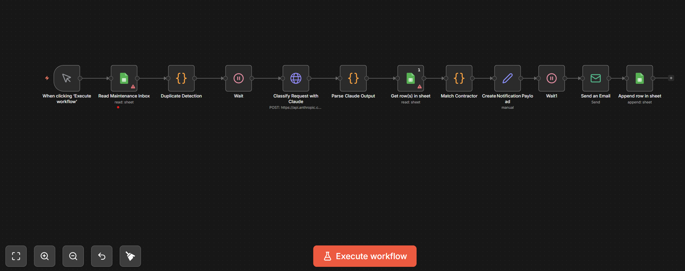

# AI-Powered Maintenance Triage Automation

An end-to-end automation workflow built in **n8n** that intercepts maintenance requests, classifies them using **Claude AI**, and automatically matches them with the appropriate contractor via **Google Sheets** logic.

## 💡 The Problem
Property managers often deal with a high volume of maintenance emails. Manually reading each one, deciding the priority, and finding the right contractor is time-consuming and prone to human error.

## 🚀 The Solution
This workflow automates the entire triage process:
1. **Ingestion**: Monitors a Google Sheet for new maintenance entries.
2. **Duplicate Detection**: Filters out redundant requests to prevent double-booking.
3. **AI Classification**: Uses Claude AI to analyze text and determine the trade required (Plumbing, Electrical, etc.) and urgency.
4. **Logic Matching**: Runs a JavaScript-based matching engine to pair the task with an available contractor.
5. **Notification**: Logs the assignment back to the master sheet and prepares for dispatch.

## 🛠️ Tech Stack
* **Automation:** [n8n](https://n8n.io/)
* **AI:** Claude (Anthropic API)
* **Database:** Google Sheets
* **Language:** JavaScript (Node.js)

---
*Note: This project was developed as part of a technical challenge. API keys and sensitive IDs have been removed for security.*
